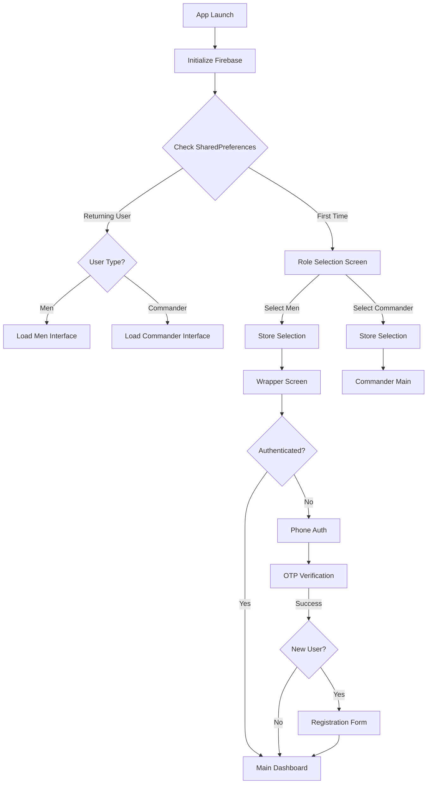

# 🛠️ TroopTrak Developer Guide

<div align="center">


**Technical documentation for TroopTrak development, architecture, and deployment**

<p>
<strong>Built with Flutter • Powered by Firebase • Dart Language</strong>
</p>

[🏠 Home](index.html) • [Architecture](#-architecture) • [Setup](#️-development-setup) • [Firebase](#-firebase-configuration) • [API Reference](#-api-reference)

</div>

---

## 📋 Table of Contents

- [Project Overview](#-project-overview)
- [Architecture](#-architecture)
  - [High-Level Architecture](#high-level-architecture)
  - [Application Flow](#application-flow)
  - [State Management](#state-management)
- [Technology Stack](#-technology-stack)
- [Project Structure](#-project-structure)
- [Development Setup](#️-development-setup)
- [Firebase Configuration](#-firebase-configuration)
- [Data Models](#-data-models)
- [Core Modules](#-core-modules)
- [Authentication System](#-authentication-system)
- [Database Schema](#-database-schema)
- [UI/UX Architecture](#-uiux-architecture)
- [Code Conventions](#-code-conventions)
- [Testing](#-testing)
- [Deployment](#-deployment)
- [API Reference](#-api-reference)
- [Performance Optimization](#-performance-optimization)
- [Security Considerations](#-security-considerations)
- [Troubleshooting](#-troubleshooting)
- [Contributing Guidelines](#-contributing-guidelines)
- [Version Control](#-version-control)

---

## 🌟 Project Overview

### About TroopTrak

**TroopTrak** is a comprehensive Flutter-based mobile application designed for military troop management. It provides real-time tracking, attendance management, conduct scheduling, and guard duty assignments with a role-based access control system.

### Project Goals

- ✅ Streamline military administrative operations
- ✅ Provide real-time troop tracking and status updates
- ✅ Implement secure role-based access control
- ✅ Ensure data consistency across multiple devices
- ✅ Deliver intuitive user experience with modern UI/UX

### Key Technical Features

- **Cross-Platform**: Single codebase for Android and iOS
- **Real-Time Sync**: Firebase Firestore for instant updates
- **Offline Support**: Local caching for offline access
- **Scalable Architecture**: Provider pattern for state management
- **Secure Authentication**: Firebase Phone Authentication with OTP
- **Responsive Design**: Adaptive UI with ScreenUtil

---

## 🏗️ Architecture

### High-Level Architecture

```
┌─────────────────────────────────────────────────────────────┐
│                     PRESENTATION LAYER                      │
│  ┌──────────┐  ┌──────────┐  ┌──────────┐  ┌──────────┐     │
│  │ Profile  │  │ Conduct  │  │  Guard   │  │  Auth    │     │
│  │ Screens  │  │ Screens  │  │  Duty    │  │ Screens  │     │
│  └──────────┘  └──────────┘  └──────────┘  └──────────┘     │
└─────────────────────────────────────────────────────────────┘
                            ▼
┌─────────────────────────────────────────────────────────────┐
│                    STATE MANAGEMENT LAYER                   │
│  ┌──────────────┐  ┌──────────────┐  ┌──────────────┐       │
│  │ AuthProvider │  │ MenUserData  │  │ ThemeManager │       │
│  │  (Provider)  │  │  (Provider)  │  │  (Provider)  │       │
│  └──────────────┘  └──────────────┘  └──────────────┘       │
└─────────────────────────────────────────────────────────────┘
                            ▼
┌─────────────────────────────────────────────────────────────┐
│                      BUSINESS LOGIC LAYER                   │
│  ┌────────────────┐  ┌────────────────┐  ┌──────────────┐   │
│  │ Authentication │  │  User Service  │  │   Firestore  │   │
│  │    Service     │  │     Logic      │  │   Queries    │   │
│  └────────────────┘  └────────────────┘  └──────────────┘   │
└─────────────────────────────────────────────────────────────┘
                            ▼
┌─────────────────────────────────────────────────────────────┐
│                        DATA LAYER                           │
│  ┌────────────────┐  ┌────────────────┐  ┌──────────────┐   │
│  │   Firebase     │  │   Firestore    │  │    Local     │   │
│  │     Auth       │  │    Database    │  │  SharedPrefs │   │
│  └────────────────┘  └────────────────┘  └──────────────┘   │
└─────────────────────────────────────────────────────────────┘
```

### Application Flow

#### Startup Flow



#### Authentication Flow

```
┌──────────────┐
│  User Opens  │
│     App      │
└──────┬───────┘
       │
       ▼
┌──────────────┐
│   Wrapper    │◄─────────┐
│   Checks     │          │
│   Auth       │          │
└──────┬───────┘          │
       │                  │
       ▼                  │
    ┌─────┐               │
    │Auth?│               │
    └──┬──┘               │
       │                  │
   ┌───┴───┐              │
   │       │              │
  Yes     No              │
   │       │              │
   │       ▼              │
   │  ┌─────────────┐     │
   │  │   Phone     │     │
   │  │   Number    │     │
   │  │   Entry     │     │
   │  └──────┬──────┘     │
   │         │            │
   │         ▼            │
   │  ┌─────────────┐     │
   │  │ Send OTP    │     │
   │  │ Via SMS     │     │
   │  └──────┬──────┘     │
   │         │            │
   │         ▼            │
   │  ┌─────────────┐     │
   │  │   Verify    │     │
   │  │    OTP      │     │
   │  └──────┬──────┘     │
   │         │            │
   │         ▼            │
   │    ┌────────┐        │
   │    │Success?│        │
   │    └───┬────┘        │
   │        │             │
   │    ┌───┴───┐         │
   │    │       │         │
   │   Yes     No         │
   │    │       └─────────┘
   │    ▼
   │ ┌─────────────┐
   │ │ Check User  │
   │ │ in Firestore│
   │ └──────┬──────┘
   │        │
   │        ▼
   │   ┌─────────┐
   │   │Exists?  │
   │   └────┬────┘
   │        │
   │   ┌────┴────┐
   │   │         │
   │  Yes       No
   │   │         │
   │   │         ▼
   │   │   ┌──────────┐
   │   │   │  User    │
   │   │   │  Info    │
   │   │   │  Form    │
   │   │   └────┬─────┘
   │   │        │
   │   │        ▼
   │   │   ┌──────────┐
   │   │   │  Save    │
   │   │   │  Data    │
   │   │   └────┬─────┘
   │   │        │
   ▼   ▼        ▼
┌───────────────┐
│ Main Dashboard│
└───────────────┘
```

### State Management

TroopTrak uses the **Provider** pattern for state management.

#### Provider Architecture

```
┌─────────────────────────────────────────────┐
│             MultiProvider (Root)            │
├─────────────────────────────────────────────┤
│                                             │
│  ┌──────────────────────────────────┐       │
│  │      AuthProvider                │       │
│  │  • Phone Authentication          │       │
│  │  • User Sign In/Out              │       │
│  │  • Session Management            │       │
│  │  • User Data Storage             │       │
│  └──────────────────────────────────┘       │
│                                             │
│  ┌──────────────────────────────────┐       │
│  │      MenUserData                 │       │
│  │  • User List Management          │       │
│  │  • Conduct Queries               │       │
│  │  • Guard Duty Data               │       │
│  │  • Status Tracking               │       │
│  │  • Attendance Streams            │       │
│  └──────────────────────────────────┘       │
│                                             │
│  ┌──────────────────────────────────┐       │
│  │      ThemeManager                │       │
│  │  • Light/Dark Theme              │       │
│  │  • Theme Persistence             │       │
│  └──────────────────────────────────┘       │
│                                             │
└─────────────────────────────────────────────┘
```

#### State Flow Example

```dart
// Consumer listens to Provider changes
Consumer<MenUserData>(
  builder: (context, userDataProvider, child) {
    return StreamBuilder<QuerySnapshot>(
      stream: userDataProvider.data, // Stream from provider
      builder: (context, snapshot) {
        // UI updates automatically on data change
      },
    );
  },
)
```

---

## 🔧 Technology Stack

### Core Technologies

| Technology | Version | Purpose |
|------------|---------|---------|
| **Flutter** | SDK ≥2.19.6 <3.0.0 | Cross-platform framework |
| **Dart** | ≥2.19.6 | Programming language |
| **Firebase Core** | ^2.12.0 | Firebase initialization |
| **Firebase Auth** | ^4.6.0 | Phone authentication |
| **Cloud Firestore** | ^4.5.3 | NoSQL database |

### Key Dependencies

#### State Management & Architecture

```yaml
provider: ^6.0.5              # State management
```

#### UI/UX Libraries

```yaml
flutter_screenutil: ^5.7.0    # Responsive design
google_fonts: ^4.0.4          # Custom fonts
google_nav_bar: ^5.0.6        # Bottom navigation
animations: ^2.0.7            # Smooth transitions
flutter_svg: ^2.0.5           # SVG rendering
fl_chart: ^0.62.0             # Data visualization
percent_indicator: ^4.2.3     # Progress indicators
auto_size_text: ^3.0.0        # Auto-sizing text
animated_snack_bar: ^0.3.1    # Snackbar notifications
flutter_icon_snackbar: ^1.1.4 # Icon snackbars
liquid_pull_to_refresh: ^3.0.1 # Pull to refresh
```

#### Data & Date Handling

```yaml
intl: ^0.17.0                 # Internationalization
recase: ^4.1.0                # String case conversion
uuid: ^3.0.7                  # UUID generation
```

#### Form & Validation

```yaml
email_validator: ^2.0.1       # Email validation
flutter_pw_validator: ^1.6.0  # Password validation
pinput: ^2.2.31               # PIN input
country_picker: ^2.0.20       # Country selection
easy_autocomplete: ^1.6.0     # Autocomplete
```

#### UI Components

```yaml
flutter_slidable: ^3.0.0      # Slidable list items
popup_card: ^0.1.0            # Popup cards
roundcheckbox: ^2.0.5         # Round checkboxes
flip_card: ^0.7.0             # Card flip animation
animated_toggle_switch: ^0.7.0 # Toggle switches
flutter_inset_box_shadow: ^1.0.8 # Advanced shadows
```

#### Specialized Components

```yaml
syncfusion_flutter_datagrid: ^21.2.10    # Data grids
syncfusion_flutter_calendar: ^21.2.3     # Calendar widget
horizontal_center_date_picker: ^2.1.1    # Date picker
```

#### Utilities

```yaml
qr_flutter: ^4.1.0            # QR code generation
mobile_scanner: ^3.3.0        # QR code scanning
image_picker: ^1.0.1          # Image selection
font_awesome_flutter: ^10.4.0 # Icon library
flutter_animated_icons: ^1.0.1 # Animated icons
observer: ^0.0.1              # Observer pattern
multiple_stream_builder: ^3.0.2 # Multi-stream handling
```

#### Local Storage

```yaml
shared_preferences: ^2.2.0    # Local key-value storage
```

#### Permissions

```yaml
permission_handler: ^10.2.0   # Permission management
```

#### Splash & Launch

```yaml
flutter_native_splash: ^2.3.1 # Splash screen
```

### Dev Dependencies

```yaml
flutter_test: sdk: flutter
flutter_lints: ^2.0.0
flutter_launcher_icons: ^0.13.1
mockito: ^5.4.2               # Testing mocks
```

### Build Configuration

```yaml
# Android
minSdkVersion: 23 (Android 6.0)
targetSdkVersion: 33

# iOS
iOS Deployment Target: 11.0

# Responsive Design
Base Size: 450 x 1000 (design reference)
```

---

## 📁 Project Structure

### Directory Layout

```
firebase_project_2/
├── android/                    # Android native code
├── ios/                        # iOS native code
├── lib/                        # Main application code
│   ├── assets/                 # Asset files
│   │   ├── army-ranks/         # Rank badge images
│   │   ├── calendar-images/    # Calendar month images
│   │   ├── phone_auth/         # Auth screen assets
│   │   └── *.png              # Icons and images
│   │
│   ├── firebase_options.dart   # Firebase configuration
│   ├── main.dart              # Application entry point
│   │
│   ├── phone_authentication/   # Authentication module
│   │   ├── provider/
│   │   │   └── auth_provider.dart       # Auth state management
│   │   ├── commander_or_man_choice_screen.dart
│   │   ├── get_user_info.dart
│   │   ├── otp_screen.dart
│   │   ├── register_page.dart
│   │   ├── wrapper.dart
│   │   └── widgets/
│   │       └── button_wrapper.dart
│   │
│   ├── screens/                # Main application screens
│   │   ├── conduct_tracker_screen/
│   │   │   ├── conduct_tracker_screen.dart
│   │   │   ├── conduct_details_screen.dart
│   │   │   └── util/
│   │   │       ├── charts/
│   │   │       │   ├── bar_graph_styling.dart
│   │   │       │   └── [chart components]
│   │   │       ├── filters/
│   │   │       └── [tiles and components]
│   │   │
│   │   ├── guard_duty_tracker_screen.dart/
│   │   │   ├── guard_duty_tracker_screen.dart
│   │   │   ├── tabs/
│   │   │   │   ├── points_leaderboard.dart
│   │   │   │   └── upcoming_duties.dart
│   │   │   └── util/
│   │   │       └── [duty components]
│   │   │
│   │   └── detailed_screen/
│   │       ├── qr_screen.dart
│   │       ├── tabs/
│   │       │   └── user_profile_tabs copy/
│   │       │       ├── user_profile_screen.dart
│   │       │       ├── user_profile_basic_info_tab.dart
│   │       │       ├── user_profile_statuses_tab.dart
│   │       │       ├── user_profile_attendance_tab.dart.dart
│   │       │       └── update_soldier_details_screen.dart
│   │       └── util/
│   │           └── [profile components]
│   │
│   ├── themes/                 # Theme configuration
│   │   ├── light_theme.dart
│   │   ├── dark_theme.dart
│   │   └── theme_manager.dart
│   │
│   ├── user_models/           # Data models
│   │   └── user_details.dart
│   │
│   ├── util/                  # Utilities
│   │   ├── constants.dart
│   │   ├── new_navbar.dart
│   │   └── text_styles/
│   │       └── text_style.dart
│   │
│   └── sign_in_assets/        # Legacy sign-in (deprecated)
│
├── assets/                    # Root asset directory
│   ├── fonts/
│   ├── images/
│   ├── logos/
│   └── videos/
│
├── test/                      # Unit & widget tests
├── web/                       # Web support files
├── windows/                   # Windows desktop files
├── linux/                     # Linux desktop files
├── macos/                     # macOS desktop files
│
├── pubspec.yaml              # Package dependencies
├── pubspec.lock              # Locked dependency versions
├── analysis_options.yaml     # Linting rules
├── README.md                 # Project README
├── firebase.json             # Firebase hosting config
└── flutter_native_splash-*.yaml # Splash screen configs
```

### Module Organization

#### Authentication Module
```
phone_authentication/
├── provider/
│   └── auth_provider.dart          # State management
├── commander_or_man_choice_screen.dart  # Role selection
├── register_page.dart              # User registration
├── otp_screen.dart                 # OTP verification
├── get_user_info.dart              # Profile input
└── wrapper.dart                    # Auth wrapper
```

#### Screens Module
```
screens/
├── conduct_tracker_screen/         # Conduct management
├── guard_duty_tracker_screen.dart/ # Guard duty management
└── detailed_screen/                # User profile & details
```

#### Common Utilities
```
util/
├── constants.dart                  # App-wide constants
├── new_navbar.dart                 # Bottom navigation
└── text_styles/                    # Custom text styles
```

---

## 🛠️ Development Setup

### Prerequisites

#### Required Tools

1. **Flutter SDK** (≥2.19.6)
   ```bash
   # Verify installation
   flutter --version
   ```

2. **Dart SDK** (Bundled with Flutter)
   ```bash
   dart --version
   ```

3. **IDE** (Choose one)
   - Android Studio (Recommended)
   - VS Code with Flutter extension
   - IntelliJ IDEA

4. **Firebase CLI**
   ```bash
   npm install -g firebase-tools
   firebase --version
   ```

5. **Git**
   ```bash
   git --version
   ```

#### Platform-Specific Requirements

**For Android Development:**
- Android Studio
- Android SDK (API 23+)
- Java Development Kit (JDK 11+)
- Android Emulator or Physical Device

**For iOS Development:**
- macOS
- Xcode (13.0+)
- CocoaPods
- iOS Simulator or Physical Device

### Installation Steps

#### 1. Clone Repository

```bash
git clone <repository-url>
cd firebase_project_2
```

#### 2. Install Dependencies

```bash
# Get Flutter packages
flutter pub get

# For iOS (macOS only)
cd ios
pod install
cd ..
```

#### 3. Firebase Setup

##### a. Create Firebase Project

1. Go to [Firebase Console](https://console.firebase.google.com/)
2. Click "Add Project"
3. Follow setup wizard

##### b. Add Android App

```bash
# Download google-services.json
# Place in: android/app/google-services.json
```

##### c. Add iOS App (macOS only)

```bash
# Download GoogleService-Info.plist
# Place in: ios/Runner/GoogleService-Info.plist
```

##### d. Enable Firebase Services

- **Authentication**: Enable Phone authentication
- **Firestore Database**: Create database in production mode
- **Storage**: Enable if needed

#### 4. Configure Firebase Options

```bash
# Install FlutterFire CLI
dart pub global activate flutterfire_cli

# Configure Firebase
flutterfire configure
```

This generates `lib/firebase_options.dart` automatically.

#### 5. Run Application

```bash
# List available devices
flutter devices

# Run on specific device
flutter run -d <device-id>

# Run in debug mode
flutter run --debug

# Run in release mode
flutter run --release
```

### Environment Configuration

#### Development Environment

```dart
// lib/config/env.dart (create this file)
class Environment {
  static const bool isDevelopment = true;
  static const String appName = 'TroopTrak Dev';
  static const String apiUrl = 'https://dev-api.example.com';
}
```

#### Production Environment

```dart
// lib/config/env.dart (production values)
class Environment {
  static const bool isDevelopment = false;
  static const String appName = 'TroopTrak';
  static const String apiUrl = 'https://api.example.com';
}
```

---

## 🔥 Firebase Configuration

### Firestore Database Structure

See [Database Schema](#-database-schema) section for complete schema.

### Security Rules

#### Firestore Rules

```javascript
rules_version = '2';
service cloud.firestore {
  match /databases/{database}/documents {
    
    // Helper function to check if user is authenticated
    function isAuthenticated() {
      return request.auth != null;
    }
    
    // Helper function to check if user owns the document
    function isOwner(userId) {
      return request.auth.uid == userId;
    }
    
    // Men collection - stores user profile data
    match /Men/{userId} {
      // Allow read if authenticated
      allow read: if isAuthenticated();
      // Allow write only to own document
      allow write: if isAuthenticated() && isOwner(userId);
    }
    
    // Users collection - main user data
    match /Users/{docId} {
      // Allow read if authenticated
      allow read: if isAuthenticated();
      // Allow write based on user role (implement role checking)
      allow write: if isAuthenticated();
      
      // Subcollections
      match /Attendance/{attendanceId} {
        allow read: if isAuthenticated();
        allow write: if isAuthenticated();
      }
      
      match /Statuses/{statusId} {
        allow read: if isAuthenticated();
        allow write: if isAuthenticated();
      }
    }
    
    // Conducts collection
    match /Conducts/{conductId} {
      allow read: if isAuthenticated();
      // Only commanders can write (implement role check)
      allow write: if isAuthenticated();
    }
    
    // Duties collection
    match /Duties/{dutyId} {
      allow read: if isAuthenticated();
      // Only commanders can write
      allow write: if isAuthenticated();
    }
  }
}
```

#### Storage Rules

```javascript
rules_version = '2';
service firebase.storage {
  match /b/{bucket}/o {
    match /{allPaths=**} {
      allow read: if request.auth != null;
      allow write: if request.auth != null && 
                      request.resource.size < 5 * 1024 * 1024; // 5MB limit
    }
  }
}
```

### Firebase Initialization

```dart
// lib/main.dart
void main() async {
  WidgetsFlutterBinding.ensureInitialized();
  
  // Initialize Firebase
  await Firebase.initializeApp(
    options: DefaultFirebaseOptions.currentPlatform,
  );
  
  runApp(const MyApp());
}
```

### Firebase Options Configuration

```dart
// lib/firebase_options.dart (auto-generated)
class DefaultFirebaseOptions {
  static FirebaseOptions get currentPlatform {
    if (kIsWeb) {
      return web;
    }
    switch (defaultTargetPlatform) {
      case TargetPlatform.android:
        return android;
      case TargetPlatform.iOS:
        return ios;
      default:
        throw UnsupportedError('Platform not supported');
    }
  }
  
  static const FirebaseOptions android = FirebaseOptions(
    apiKey: 'YOUR_API_KEY',
    appId: 'YOUR_APP_ID',
    messagingSenderId: 'YOUR_SENDER_ID',
    projectId: 'YOUR_PROJECT_ID',
    storageBucket: 'YOUR_STORAGE_BUCKET',
  );
  
  static const FirebaseOptions ios = FirebaseOptions(
    apiKey: 'YOUR_API_KEY',
    appId: 'YOUR_APP_ID',
    messagingSenderId: 'YOUR_SENDER_ID',
    projectId: 'YOUR_PROJECT_ID',
    storageBucket: 'YOUR_STORAGE_BUCKET',
    iosClientId: 'YOUR_IOS_CLIENT_ID',
    iosBundleId: 'YOUR_BUNDLE_ID',
  );
}
```

---

## 📊 Data Models

### Class Diagram

```
┌─────────────────────────────────────────────────────────────┐
│                         User Model                          │
├─────────────────────────────────────────────────────────────┤
│ - uid: String                                               │
│ - name: String                                              │
│ - rank: String                                              │
│ - company: String                                           │
│ - platoon: String                                           │
│ - section: String                                           │
│ - appointment: String                                       │
│ - dob: String                                               │
│ - enlistment: String                                        │
│ - ord: String                                               │
│ - rationType: String                                        │
│ - bloodgroup: String                                        │
│ - points: double                                            │
│ - QRid: String?                                             │
├─────────────────────────────────────────────────────────────┤
│ + toMap(): Map<String, dynamic>                             │
│ + fromMap(Map<String, dynamic>): User                       │
└─────────────────────────────────────────────────────────────┘
                            △
                            │
                            │
         ┌──────────────────┴──────────────────┐
         │                                      │
┌────────┴──────────┐               ┌──────────┴─────────┐
│   Men User        │               │   Commander User   │
│   (CFC & below)   │               │   (3SG & above)    │
├───────────────────┤               ├────────────────────┤
│ - canViewOwn()    │               │ - canViewAll()     │
│ - canEditOwn()    │               │ - canEditAll()     │
└───────────────────┘               │ - canCreate()      │
                                    │ - canDelete()      │
                                    └────────────────────┘


┌─────────────────────────────────────────────────────────────┐
│                        Conduct Model                        │
├─────────────────────────────────────────────────────────────┤
│ - conductID: String                                         │
│ - conductName: String                                       │
│ - conductType: String                                       │
│ - startDate: String                                         │
│ - startTime: String                                         │
│ - endTime: String                                           │
│ - participants: List<String>                                │
│ - nonParticipants: List<String>                             │
├─────────────────────────────────────────────────────────────┤
│ + addParticipant(String name): void                         │
│ + removeParticipant(String name): void                      │
│ + isParticipant(String name): bool                          │
│ + toMap(): Map<String, dynamic>                             │
│ + fromMap(Map<String, dynamic>): Conduct                    │
└─────────────────────────────────────────────────────────────┘


┌─────────────────────────────────────────────────────────────┐
│                         Duty Model                          │
├─────────────────────────────────────────────────────────────┤
│ - dutyID: String                                            │
│ - dutyDate: String                                          │
│ - dutyTime: String                                          │
│ - dutyLocation: String                                      │
│ - personnel: List<String>                                   │
│ - commander: String                                         │
│ - points: int                                               │
├─────────────────────────────────────────────────────────────┤
│ + assignPersonnel(String name): void                        │
│ + removePersonnel(String name): void                        │
│ + toMap(): Map<String, dynamic>                             │
│ + fromMap(Map<String, dynamic>): Duty                       │
└─────────────────────────────────────────────────────────────┘


┌─────────────────────────────────────────────────────────────┐
│                        Status Model                         │
├─────────────────────────────────────────────────────────────┤
│ - statusID: String                                          │
│ - userName: String                                          │
│ - statusType: String  (Excuse / Leave / Other)              │
│ - statusName: String                                        │
│ - startDate: String                                         │
│ - endDate: String                                           │
│ - remarks: String?                                          │
├─────────────────────────────────────────────────────────────┤
│ + isActive(): bool                                          │
│ + isExpired(): bool                                         │
│ + toMap(): Map<String, dynamic>                             │
│ + fromMap(Map<String, dynamic>): Status                     │
└─────────────────────────────────────────────────────────────┘


┌─────────────────────────────────────────────────────────────┐
│                      Attendance Model                       │
├─────────────────────────────────────────────────────────────┤
│ - attendanceID: String                                      │
│ - userName: String                                          │
│ - timestamp: DateTime                                       │
│ - isInsideCamp: bool                                        │
│ - action: String  (Book In / Book Out)                      │
├─────────────────────────────────────────────────────────────┤
│ + toMap(): Map<String, dynamic>                             │
│ + fromMap(Map<String, dynamic>): Attendance                 │
└─────────────────────────────────────────────────────────────┘
```

### State Management Classes

```
┌─────────────────────────────────────────────────────────────┐
│            AuthProvider extends ChangeNotifier              │
├─────────────────────────────────────────────────────────────┤
│ - _isSignedIn: bool                                         │
│ - _isLoading: bool                                          │
│ - _userid: String?                                          │
│ - _data: Map<String, dynamic>?                              │
│ - _selector: int?                                           │
├─────────────────────────────────────────────────────────────┤
│ + signInWithPhone(context, phoneNumber): void               │
│ + verifyOTP(context, verificationId, otp, callback): void   │
│ + checkExistingUser(): Future<bool>                         │
│ + saveUserData(...): Future<void>                           │
│ + userSignOut(): Future<void>                               │
│ + getUserData(): Future<void>                               │
│ + checkSignIn(): void                                       │
│ + setSignIn(): void                                         │
└─────────────────────────────────────────────────────────────┘


┌─────────────────────────────────────────────────────────────┐
│           MenUserData extends ChangeNotifier                │
├─────────────────────────────────────────────────────────────┤
│ - documentIDs: List<String>                                 │
│ - userDetails: List<Map<String, dynamic>>                   │
│ - statusList: List<Map<String, dynamic>>                    │
│ - attendance_list: List<Map<String, dynamic>>               │
│ - fullList: Map<String, dynamic>                            │
├─────────────────────────────────────────────────────────────┤
│ + get data: Stream<QuerySnapshot>                           │
│ + get conducts_data: Stream<QuerySnapshot>                  │
│ + get duty_data: Stream<QuerySnapshot>                      │
│ + conduct_data(docID): Stream<DocumentSnapshot>             │
│ + status_data(docID): Stream<QuerySnapshot>                 │
│ + attendance_data(docID): Stream<QuerySnapshot>             │
│ + userData_data(docID): Stream<DocumentSnapshot>            │
│ + menData_data(docID): Stream<DocumentSnapshot>             │
│ + getUserStatus(ID): Future<bool>                           │
│ + todayDuty(): Future<List<Map<String, dynamic>>>           │
│ + inCamp(): Future<void>                                    │
│ + autoFilter(): Future<void>                                │
└─────────────────────────────────────────────────────────────┘


┌─────────────────────────────────────────────────────────────┐
│                  ThemeManager (Singleton)                   │
├─────────────────────────────────────────────────────────────┤
│ - _themeMode: ThemeMode                                     │
├─────────────────────────────────────────────────────────────┤
│ + get themeMode: ThemeMode                                  │
│ + toggleTheme(isDark): void                                 │
└─────────────────────────────────────────────────────────────┘
```

### Model Implementation Example

```dart
// lib/user_models/user_model.dart
class UserModel {
  final String uid;
  final String name;
  final String rank;
  final String company;
  final String platoon;
  final String section;
  final String appointment;
  final String dob;
  final String enlistment;
  final String ord;
  final String rationType;
  final String bloodgroup;
  final double points;
  final String? qrId;

  UserModel({
    required this.uid,
    required this.name,
    required this.rank,
    required this.company,
    required this.platoon,
    required this.section,
    required this.appointment,
    required this.dob,
    required this.enlistment,
    required this.ord,
    required this.rationType,
    required this.bloodgroup,
    required this.points,
    this.qrId,
  });

  // Convert to Map for Firestore
  Map<String, dynamic> toMap() {
    return {
      'name': name,
      'rank': rank,
      'company': company,
      'platoon': platoon,
      'section': section,
      'appointment': appointment,
      'dob': dob,
      'enlistment': enlistment,
      'ord': ord,
      'rationType': rationType,
      'bloodgroup': bloodgroup,
      'points': points,
      'QRid': qrId,
    };
  }

  // Create from Firestore document
  factory UserModel.fromMap(Map<String, dynamic> map, String uid) {
    return UserModel(
      uid: uid,
      name: map['name'] ?? '',
      rank: map['rank'] ?? '',
      company: map['company'] ?? '',
      platoon: map['platoon'] ?? '',
      section: map['section'] ?? '',
      appointment: map['appointment'] ?? '',
      dob: map['dob'] ?? '',
      enlistment: map['enlistment'] ?? '',
      ord: map['ord'] ?? '',
      rationType: map['rationType'] ?? '',
      bloodgroup: map['bloodgroup'] ?? '',
      points: (map['points'] ?? 0).toDouble(),
      qrId: map['QRid'],
    );
  }

  // Copy with method for updates
  UserModel copyWith({
    String? name,
    String? rank,
    String? company,
    // ... other fields
  }) {
    return UserModel(
      uid: this.uid,
      name: name ?? this.name,
      rank: rank ?? this.rank,
      company: company ?? this.company,
      // ... other fields
    );
  }
}
```

---

## 🔐 Authentication System

### Authentication Flow Diagram

```
┌──────────────────────────────────────────────────────────┐
│                  Authentication System                   │
└──────────────────────────────────────────────────────────┘

1. Phone Number Entry
   ↓
   User enters: +65 9123 4567
   ↓
2. Firebase Phone Auth
   ↓
   FirebaseAuth.instance.verifyPhoneNumber()
   ↓
3. SMS OTP Sent
   ↓
   6-digit code sent to user's phone
   ↓
4. OTP Verification
   ↓
   User enters OTP code
   ↓
   PhoneAuthCredential created
   ↓
5. Sign In with Credential
   ↓
   signInWithCredential(credential)
   ↓
6. Check User Existence
   ↓
   Query Firestore 'Men' collection
   ↓
   ┌────────────────┐
   │ User exists?   │
   └────────┬───────┘
            │
    ┌───────┴────────┐
    │                │
   Yes              No
    │                │
    ▼                ▼
  Load User      Registration
  Profile        Form
    │                │
    │                ▼
    │           Fill details:
    │           - Name, Rank
    │           - Company, etc.
    │                │
    │                ▼
    │           Save to Firestore
    │                │
    └────────┬───────┘
             │
             ▼
      Set SharedPreferences
      (is_signedin = true)
             │
             ▼
      Navigate to Main App
```

### Implementation Details

#### AuthProvider Class

```dart
// lib/phone_authentication/provider/auth_provider.dart

class AuthProvider extends ChangeNotifier {
  // State variables
  bool _isSignedIn = false;
  bool _isLoading = false;
  String? _userid;
  Map<String, dynamic>? _data;
  
  // Firebase instances
  final firebase_auth = FirebaseAuth.instance;
  final firebase_store = FirebaseFirestore.instance.collection('Men');
  
  // Getters
  bool get isSignedIn => _isSignedIn;
  bool get isLoading => _isLoading;
  String? get userid => _userid;
  Map<String, dynamic> get data => _data!;
  
  // Constructor checks sign-in status
  AuthProvider() {
    checkSignIn();
  }
  
  // Check if user is signed in
  void checkSignIn() async {
    final SharedPreferences s = await SharedPreferences.getInstance();
    _isSignedIn = s.getBool('is_signedin') ?? false;
    notifyListeners();
  }
  
  // Set signed-in status
  void setSignIn() async {
    final SharedPreferences s = await SharedPreferences.getInstance();
    s.setBool('is_signedin', true);
    _isSignedIn = true;
    notifyListeners();
  }
  
  // Sign in with phone number
  void signInWithPhone(BuildContext context, String phoneNumber) async {
    try {
      await firebase_auth.verifyPhoneNumber(
        phoneNumber: phoneNumber,
        timeout: const Duration(seconds: 60),
        
        // Auto-verification callback
        verificationCompleted: (PhoneAuthCredential credential) async {
          await firebase_auth.signInWithCredential(credential);
        },
        
        // Error callback
        verificationFailed: (FirebaseAuthException error) {
          // Show error snackbar
          throw Exception(error.message);
        },
        
        // Code sent callback
        codeSent: (String verificationId, int? forceResendingToken) {
          // Navigate to OTP screen
          Navigator.push(
            context,
            MaterialPageRoute(
              builder: (context) => OtpScreen(
                verificationId: verificationId,
              ),
            ),
          );
        },
        
        // Auto-retrieval timeout
        codeAutoRetrievalTimeout: (String verificationId) {},
      );
    } on FirebaseAuthException catch (e) {
      // Handle error
    }
  }
  
  // Verify OTP
  void verifyOTP({
    required BuildContext context,
    required String verificationId,
    required String otp,
    required Function onsuccess,
  }) async {
    _isLoading = true;
    notifyListeners();
    
    try {
      // Create credential
      PhoneAuthCredential creds = PhoneAuthProvider.credential(
        verificationId: verificationId,
        smsCode: otp,
      );
      
      // Sign in
      User? user = (await firebase_auth.signInWithCredential(creds)).user;
      
      if (user != null) {
        _userid = user.uid;
        onsuccess();
      }
      
      _isLoading = false;
      notifyListeners();
    } on FirebaseAuthException catch (e) {
      // Handle error
      _isLoading = false;
      notifyListeners();
    }
  }
  
  // Check if user exists in Firestore
  Future<bool> checkExistingUser() async {
    DocumentSnapshot snapshot = await firebase_store.doc(_userid).get();
    return snapshot.exists;
  }
  
  // Save user data to Firestore
  Future<void> saveUserData(
    BuildContext context,
    String name,
    String section,
    String platoon,
    String company,
    String appointment,
    String dob,
    String ord,
    String enlistment,
    String rationType,
    String bloodgroup,
    double points,
    String rank,
  ) async {
    _isLoading = true;
    notifyListeners();
    
    try {
      await firebase_store.doc(_userid).set({
        'rank': rank,
        'name': name,
        'company': company,
        'platoon': platoon,
        'section': section,
        'appointment': appointment,
        'rationType': rationType,
        'bloodgroup': bloodgroup,
        'dob': dob,
        'ord': ord,
        'enlistment': enlistment,
        'points': 0,
        'QRid': null,
      });
      
      // Update display name
      await firebase_auth.currentUser!.updateDisplayName(name);
      
      _isLoading = false;
      notifyListeners();
    } on FirebaseAuthException catch (e) {
      // Handle error
      _isLoading = false;
      notifyListeners();
    }
  }
  
  // Sign out
  Future<void> userSignOut() async {
    SharedPreferences s = await SharedPreferences.getInstance();
    await firebase_auth.signOut();
    _isSignedIn = false;
    _userid = null;
    notifyListeners();
    await s.clear();
  }
  
  // Get user data from Firestore
  Future<void> getUserData() async {
    await firebase_store
        .doc(firebase_auth.currentUser!.uid)
        .get()
        .then((DocumentSnapshot snapshot) {
      _data = snapshot.data() as Map<String, dynamic>;
      _userid = firebase_auth.currentUser!.uid;
    });
  }
}
```

### Security Considerations

1. **Phone Verification**
   - Uses Firebase Phone Auth for secure OTP delivery
   - 60-second timeout on OTP
   - Single-use OTP codes

2. **Session Management**
   - Firebase handles token refresh automatically
   - Persistent sign-in with SharedPreferences
   - Secure sign-out clears all local data

3. **Data Protection**
   - User data encrypted in transit (HTTPS)
   - Firestore security rules enforce access control
   - No sensitive data stored locally

---

## 🗄️ Database Schema

### Firestore Collections Structure

```
firestore
├── Men/                          # User profiles collection
│   └── {uid}/                    # Document ID = Firebase Auth UID
│       ├── name: String
│       ├── rank: String
│       ├── company: String
│       ├── platoon: String
│       ├── section: String
│       ├── appointment: String
│       ├── dob: String
│       ├── enlistment: String
│       ├── ord: String
│       ├── rationType: String
│       ├── bloodgroup: String
│       ├── points: Number
│       └── QRid: String | null
│
├── Users/                        # Main user data collection
│   └── {name}/                   # Document ID = User's name
│       ├── name: String
│       ├── rank: String
│       ├── company: String
│       ├── platoon: String
│       ├── section: String
│       ├── appointment: String
│       │
│       ├── Attendance/           # Subcollection
│       │   └── {attendanceId}/
│       │       ├── timestamp: Timestamp
│       │       ├── isInsideCamp: Boolean
│       │       ├── action: String
│       │       └── date: String
│       │
│       └── Statuses/             # Subcollection
│           └── {statusId}/
│               ├── statusType: String
│               ├── statusName: String
│               ├── startDate: String
│               ├── endDate: String
│               ├── Name: String
│               └── remarks: String?
│
├── Conducts/                     # Conduct/training events
│   └── {conductId}/
│       ├── conductName: String
│       ├── conductType: String
│       ├── startDate: String
│       ├── startTime: String
│       ├── endTime: String
│       ├── participants: Array<String>
│       └── nonParticipants: Array<String>
│
└── Duties/                       # Guard duty assignments
    └── {dutyId}/
        ├── dutyDate: String
        ├── dutyTime: String
        ├── dutyLocation: String
        ├── personnel: Array<String>
        ├── commander: String
        └── points: Number
```

### Entity Relationship Diagram

```
┌──────────────┐          ┌──────────────┐
│     Men      │          │    Users     │
│  (Profile)   │          │  (Main Data) │
└───────┬──────┘          └───────┬──────┘
        │                         │
        │ 1:1 (via name)          │
        └─────────────────────────┘
                    │
        ┌───────────┼───────────┐
        │                       │
        ▼                       ▼
┌──────────────┐      ┌──────────────┐
│  Attendance  │      │   Statuses   │
│(Subcollection│      │(Subcollection│
└──────────────┘      └──────────────┘


┌──────────────┐          ┌──────────────┐
│   Conducts   │◄────────►│    Users     │
│  (Events)    │  M:N     │              │
└──────────────┘          └──────────────┘
        │
        │ contains
        ▼
    participants[]
    (Array of names)


┌──────────────┐          ┌──────────────┐
│    Duties    │◄────────►│    Users     │
│ (Guard Duty) │  M:N     │              │
└──────────────┘          └──────────────┘
        │
        │ contains
        ▼
    personnel[]
    (Array of names)
```

### Collection Details

#### 1. Men Collection

**Purpose**: Stores user profile data linked to Firebase Auth UID

**Document ID**: Firebase Auth User ID (UID)

**Fields**:

| Field | Type | Description | Required | Example |
|-------|------|-------------|----------|---------|
| name | String | Full name | Yes | "John Tan Wei Ming" |
| rank | String | Military rank | Yes | "CPL" |
| company | String | Company designation | Yes | "Alpha" |
| platoon | String | Platoon number | Yes | "1" |
| section | String | Section number | Yes | "3" |
| appointment | String | Current role | Yes | "Rifleman" |
| dob | String | Date of birth | Yes | "15 Mar 1999" |
| enlistment | String | Enlistment date | Yes | "10 Jan 2018" |
| ord | String | ORD date | Yes | "09 Jan 2020" |
| rationType | String | Dietary requirements | Yes | "No Pork" |
| bloodgroup | String | Blood type | Yes | "B+" |
| points | Number | Guard duty points | Yes | 15.0 |
| QRid | String/Null | QR code ID | No | null |

**Indexes**: None (small collection, document ID used for queries)

#### 2. Users Collection

**Purpose**: Main user data with attendance and status subcollections

**Document ID**: User's name (String)

**Fields**:

| Field | Type | Description |
|-------|------|-------------|
| name | String | User's full name |
| rank | String | Military rank |
| company | String | Company |
| platoon | String | Platoon |
| section | String | Section |
| appointment | String | Appointment |

**Subcollections**:

##### a. Attendance Subcollection

**Path**: `Users/{name}/Attendance/{attendanceId}`

**Fields**:

| Field | Type | Description | Example |
|-------|------|-------------|---------|
| timestamp | Timestamp | Date and time | 2024-01-10 08:30:00 |
| isInsideCamp | Boolean | Current location status | true |
| action | String | Book in/out action | "Book In" |
| date | String | Formatted date | "10 Jan 2024" |

##### b. Statuses Subcollection

**Path**: `Users/{name}/Statuses/{statusId}`

**Fields**:

| Field | Type | Description | Example |
|-------|------|-------------|---------|
| statusType | String | Type of status | "Excuse" / "Leave" |
| statusName | String | Status name | "Ex Boots" |
| startDate | String | Start date | "05 Jan 2024" |
| endDate | String | End date | "15 Jan 2024" |
| Name | String | User's name | "John Tan" |
| remarks | String | Optional notes | "Medical certificate attached" |

**Indexes**: Composite index on `statusType` + `statusName` for filtering

#### 3. Conducts Collection

**Purpose**: Training events and activities

**Document ID**: Auto-generated

**Fields**:

| Field | Type | Description | Example |
|-------|------|-------------|---------|
| conductName | String | Name of conduct | "Field Training Exercise" |
| conductType | String | Type/category | "Training" |
| startDate | String | Start date | "10 Jan 2024" |
| startTime | String | Start time | "08:00" |
| endTime | String | End time | "17:00" |
| participants | Array | List of participant names | ["John Tan", "Mike Lee"] |
| nonParticipants | Array | Excluded personnel | ["David Lim"] |

**Indexes**: Index on `startDate` for date queries

#### 4. Duties Collection

**Purpose**: Guard duty assignments

**Document ID**: Auto-generated

**Fields**:

| Field | Type | Description | Example |
|-------|------|-------------|---------|
| dutyDate | String | Duty date | "10 Jan 2024" |
| dutyTime | String | Time slot | "00:00 - 08:00" |
| dutyLocation | String | Duty location | "Main Gate" |
| personnel | Array | Assigned personnel | ["John Tan", "Mike Lee"] |
| commander | String | Duty commander | "CPL Alex Koh" |
| points | Number | Points awarded | 5 |

**Indexes**: Index on `dutyDate` for date queries

### Query Examples

#### Get User Profile

```dart
// Get by UID (Men collection)
DocumentSnapshot userDoc = await FirebaseFirestore.instance
    .collection('Men')
    .doc(FirebaseAuth.instance.currentUser!.uid)
    .get();

Map<String, dynamic> userData = userDoc.data() as Map<String, dynamic>;
```

#### Get User Attendance

```dart
// Stream of attendance records
Stream<QuerySnapshot> attendanceStream = FirebaseFirestore.instance
    .collection('Users')
    .doc(userName)
    .collection('Attendance')
    .orderBy('timestamp', descending: true)
    .snapshots();
```

#### Get Today's Conducts

```dart
// Query conducts by date
QuerySnapshot conductQuery = await FirebaseFirestore.instance
    .collection('Conducts')
    .where('startDate', isEqualTo: DateFormat("d MMM yyyy").format(DateTime.now()))
    .get();

List<Map<String, dynamic>> todayConducts = conductQuery.docs
    .map((doc) => doc.data() as Map<String, dynamic>)
    .toList();
```

#### Get Active Statuses

```dart
// Query excuses for guard duty
QuerySnapshot statusQuery = await FirebaseFirestore.instance
    .collection('Users')
    .doc(userName)
    .collection('Statuses')
    .where('statusType', isEqualTo: 'Excuse')
    .where('statusName', whereIn: ['Ex Boots', 'Ex Uniform'])
    .get();
```

#### Get Guard Duty Leaderboard

```dart
// Query users ordered by points
QuerySnapshot leaderboardQuery = await FirebaseFirestore.instance
    .collection('Men')
    .orderBy('points', descending: true)
    .limit(10)
    .get();
```

### Data Flow Diagram

```
User Action
     │
     ▼
Flutter Widget
     │
     ▼
Provider (State Management)
     │
     ▼
Firestore Query/Mutation
     │
     ▼
Firebase Cloud
     │
     ▼
Real-time Update
     │
     ▼
StreamBuilder Rebuild
     │
     ▼
UI Update
```

---

## 🎨 UI/UX Architecture

### Theme System

#### Color Palette

```dart
// lib/themes/light_theme.dart & dark_theme.dart

// Primary Colors
const primaryPurple = Color(0xFF8147E6);      // #8147E6
const darkPurple = Color(0xFF481EE5);         // #481EE5
const lightPurple = Color(0xFF823CE6);        // #823CE6

// Background Colors
const darkBackground = Color(0xFF151922);     // #151922
const cardBackground = Color(0xFF212836);     // #212836
const borderColor = Color(0xFF481EE5);        // #481EE5 with opacity

// Text Colors
const textWhite = Colors.white;
const textWhite54 = Colors.white54;
const textWhite60 = Colors.white60;

// Accent Colors
const successGreen = Colors.green;
const errorRed = Colors.red;
const warningOrange = Colors.orange;
```

#### Typography

```dart
// Using Google Fonts - Poppins
GoogleFonts.poppins(
  fontSize: 32.sp,
  fontWeight: FontWeight.bold,
  color: Colors.white,
  letterSpacing: 1.5,
)
```

**Font Weights Used**:
- `FontWeight.w400` - Regular text
- `FontWeight.w500` - Medium emphasis
- `FontWeight.w600` - Semi-bold headings
- `FontWeight.w800` - Heavy emphasis
- `FontWeight.bold` - Bold text

### Responsive Design

```dart
// Using flutter_screenutil
ScreenUtilInit(
  designSize: const Size(450, 1000),  // Base design dimensions
  builder: (context, child) => MaterialApp(...)
)

// Usage in widgets
width: 300.w,        // Responsive width
height: 200.h,       // Responsive height
fontSize: 24.sp,     // Responsive font size
padding: 16.sp,      // Responsive padding
```

### Component Architecture

#### Bottom Navigation

```
┌─────────────────────────────────────────┐
│       GNav (Google Nav Bar)             │
├─────────────────────────────────────────┤
│  [👤 My Profile]  [📊 Conduct]  [🛡️ Duty] │
└─────────────────────────────────────────┘
```

**Implementation**:

```dart
GNav(
  gap: 7,
  backgroundColor: Color.fromARGB(255, 11, 13, 17),
  color: Colors.deepPurple.shade300,
  activeColor: Colors.white,
  tabBackgroundGradient: LinearGradient(
    colors: [
      Color.fromARGB(255, 72, 30, 229),
      Colors.deepPurple.shade600,
    ],
  ),
  tabs: [
    GButton(icon: Icons.person, text: 'My Profile'),
    GButton(icon: Icons.track_changes_rounded, text: 'Conduct Tracker'),
    GButton(icon: Icons.safety_check, text: 'Guard Duty'),
  ],
)
```

#### Card Components

**Styled Container**:

```dart
Container(
  decoration: BoxDecoration(
    border: Border.all(
      width: 2.w,
      color: Color.fromARGB(255, 72, 30, 229).withOpacity(0.35),
    ),
    borderRadius: BorderRadius.all(Radius.circular(12.r)),
    gradient: LinearGradient(
      colors: [
        Color.fromARGB(255, 72, 30, 229),
        Color.fromARGB(255, 130, 60, 229),
      ],
    ),
  ),
  child: // Content
)
```

#### Animation Patterns

1. **Hero Animations** - For QR code popup
2. **Liquid Pull to Refresh** - For data refresh
3. **Animated Toggle Switch** - For filters
4. **Flip Cards** - For interactive elements
5. **Lottie Animations** - For empty states

### Screen Layouts

#### Profile Screen Layout

```
╔═══════════════════════════════════════╗
║  ┌─────────────────────────────────┐  ║
║  │   Gradient Header               │  ║
║  │   • Name & Rank Badge           │  ║
║  │   • Appointment                 │  ║
║  │   • Company/Platoon/Section     │  ║
║  │   • QR Code Button              │  ║
║  └─────────────────────────────────┘  ║
║  ┌─────────────────────────────────┐  ║
║  │   Tab Bar                       │  ║
║  │  [Basic Info][Statuses][Attend.]│  ║
║  └─────────────────────────────────┘  ║
║  ┌─────────────────────────────────┐  ║
║  │                                 │  ║
║  │   Tab Content                   │  ║
║  │   (Scrollable)                  │  ║
║  │                                 │  ║
║  └─────────────────────────────────┘  ║
╚═══════════════════════════════════════╝
```

#### Conduct Tracker Layout

```
╔═══════════════════════════════════════╗
║  Title: "Conduct Tracker"             ║
║  ┌─────────────────────────────────┐  ║
║  │  Date Display & Picker          │  ║
║  └─────────────────────────────────┘  ║
║  ┌─────────────────────────────────┐  ║
║  │  Horizontal Date Scroller       │  ║
║  └─────────────────────────────────┘  ║
║  ┌─────────────────────────────────┐  ║
║  │  Participation Bar Chart        │  ║
║  └─────────────────────────────────┘  ║
║  ┌─────────────────────────────────┐  ║
║  │  Conduct Card 1                 │  ║
║  └─────────────────────────────────┘  ║
║  ┌─────────────────────────────────┐  ║
║  │  Conduct Card 2                 │  ║
║  └─────────────────────────────────┘  ║
╚═══════════════════════════════════════╝
```

---

## 📝 Code Conventions

### Dart/Flutter Best Practices

#### Naming Conventions

```dart
// Classes: PascalCase
class UserProfileScreen extends StatefulWidget { }

// Variables & Functions: camelCase
String userName = "John Tan";
void fetchUserData() { }

// Constants: lowerCamelCase or UPPER_SNAKE_CASE
const double defaultPadding = 16.0;
const String API_KEY = "...";

// Private members: prefix with underscore
class _UserProfileScreenState extends State<UserProfileScreen> { }
bool _isLoading = false;

// Files: snake_case
// user_profile_screen.dart
// auth_provider.dart
```

#### Code Organization

```dart
// Import order:
// 1. Dart/Flutter SDK
import 'package:flutter/material.dart';
import 'package:cloud_firestore/cloud_firestore.dart';

// 2. Third-party packages
import 'package:provider/provider.dart';
import 'package:google_fonts/google_fonts.dart';

// 3. Project imports
import 'package:firebase_project_2/util/constants.dart';
import 'package:firebase_project_2/user_models/user_details.dart';

// Class structure order:
class MyWidget extends StatefulWidget {
  // 1. Const constructor parameters
  const MyWidget({super.key, required this.data});
  
  // 2. Final fields
  final String data;
  
  // 3. State creation
  @override
  State<MyWidget> createState() => _MyWidgetState();
}

class _MyWidgetState extends State<MyWidget> {
  // 1. State variables
  bool _isLoading = false;
  
  // 2. Lifecycle methods
  @override
  void initState() {
    super.initState();
  }
  
  @override
  void dispose() {
    super.dispose();
  }
  
  // 3. Helper methods
  void _helperFunction() { }
  
  // 4. Build method (last)
  @override
  Widget build(BuildContext context) {
    return Container();
  }
}
```

#### Widget Composition

```dart
// Prefer composition over deep nesting
// BAD:
Widget build(BuildContext context) {
  return Container(
    child: Column(
      children: [
        Container(
          child: Text('...'),
        ),
      ],
    ),
  );
}

// GOOD:
Widget build(BuildContext context) {
  return Container(
    child: Column(
      children: [
        _buildTextWidget(),
      ],
    ),
  );
}

Widget _buildTextWidget() {
  return Container(
    child: Text('...'),
  );
}
```

#### Async/Await Usage

```dart
// Always use async/await for async operations
Future<void> fetchData() async {
  try {
    final result = await FirebaseFirestore.instance
        .collection('Users')
        .get();
    
    // Process result
  } catch (e) {
    // Handle error
    print('Error: $e');
  }
}
```

#### State Management Patterns

```dart
// Use Provider for state management
class MyWidget extends StatelessWidget {
  @override
  Widget build(BuildContext context) {
    // Listen to provider changes
    final userDataProvider = Provider.of<MenUserData>(context);
    
    return StreamBuilder<QuerySnapshot>(
      stream: userDataProvider.data,
      builder: (context, snapshot) {
        if (snapshot.hasData) {
          // Build UI
        }
        return CircularProgressIndicator();
      },
    );
  }
}
```

### Documentation Standards

```dart
/// Fetches user profile data from Firestore.
///
/// Retrieves the user document using the provided [userId] from
/// the 'Men' collection in Firestore.
///
/// Returns a [Map<String, dynamic>] containing user data.
/// Throws [FirebaseException] if the fetch fails.
///
/// Example:
/// ```dart
/// final userData = await getUserProfile('user123');
/// print(userData['name']); // John Tan
/// ```
Future<Map<String, dynamic>> getUserProfile(String userId) async {
  // Implementation
}
```

### Error Handling

```dart
// Comprehensive error handling
try {
  await FirebaseFirestore.instance
      .collection('Users')
      .doc(userId)
      .set(data);
} on FirebaseException catch (e) {
  // Handle Firebase-specific errors
  print('Firebase error: ${e.code} - ${e.message}');
  _showErrorSnackbar(context, 'Failed to save data');
} catch (e) {
  // Handle general errors
  print('Unexpected error: $e');
  _showErrorSnackbar(context, 'An unexpected error occurred');
}
```

---

## ⚙️ Performance Optimization

### Firestore Optimization

#### 1. Use Streams Efficiently

```dart
// Cache stream to avoid multiple subscriptions
late Stream<QuerySnapshot> _conductStream;

@override
void initState() {
  super.initState();
  _conductStream = FirebaseFirestore.instance
      .collection('Conducts')
      .snapshots();
}

// Use single StreamBuilder
StreamBuilder<QuerySnapshot>(
  stream: _conductStream,  // Reuse stream
  builder: (context, snapshot) { }
)
```

#### 2. Limit Query Results

```dart
// Use limit for large collections
FirebaseFirestore.instance
    .collection('Users')
    .orderBy('points', descending: true)
    .limit(10)  // Only fetch top 10
    .get();
```

#### 3. Index Composite Queries

```
// firestore.indexes.json
{
  "indexes": [
    {
      "collectionGroup": "Statuses",
      "queryScope": "COLLECTION",
      "fields": [
        {"fieldPath": "statusType", "order": "ASCENDING"},
        {"fieldPath": "statusName", "order": "ASCENDING"}
      ]
    }
  ]
}
```

### UI Performance

#### 1. Use const Widgets

```dart
// Use const for immutable widgets
const SizedBox(height: 20);
const Icon(Icons.person);
const Text('Static text');
```

#### 2. ListView.builder for Long Lists

```dart
// Use builder for efficient list rendering
ListView.builder(
  shrinkWrap: true,
  itemCount: conducts.length,
  itemBuilder: (context, index) {
    return ConductTile(conduct: conducts[index]);
  },
)
```

#### 3. Lazy Loading with Pagination

```dart
// Implement pagination for large datasets
QuerySnapshot firstBatch = await FirebaseFirestore.instance
    .collection('Users')
    .limit(20)
    .get();

// Load next batch
QuerySnapshot nextBatch = await FirebaseFirestore.instance
    .collection('Users')
    .startAfterDocument(firstBatch.docs.last)
    .limit(20)
    .get();
```

### Memory Management

#### 1. Dispose Controllers

```dart
class _MyWidgetState extends State<MyWidget> {
  late AnimationController _controller;
  
  @override
  void initState() {
    super.initState();
    _controller = AnimationController(vsync: this);
  }
  
  @override
  void dispose() {
    _controller.dispose();  // Always dispose
    super.dispose();
  }
}
```

#### 2. Cancel Streams

```dart
StreamSubscription? _subscription;

void startListening() {
  _subscription = stream.listen((data) { });
}

@override
void dispose() {
  _subscription?.cancel();
  super.dispose();
}
```

### Build Optimization

#### 1. Enable Code Shrinking

```gradle
// android/app/build.gradle
buildTypes {
  release {
    minifyEnabled true
    shrinkResources true
    proguardFiles getDefaultProguardFile('proguard-android.txt')
  }
}
```

#### 2. Split APKs by ABI

```gradle
android {
  splits {
    abi {
      enable true
      reset()
      include 'armeabi-v7a', 'arm64-v8a', 'x86_64'
      universalApk false
    }
  }
}
```

---

## 🔒 Security Considerations

### Authentication Security

1. **Phone Number Verification**
   - OTP expires after 60 seconds
   - Single-use codes
   - Rate limiting via Firebase

2. **Session Management**
   - Tokens auto-refreshed by Firebase
   - Secure logout clears local storage

### Data Security

1. **Firestore Rules**
   - See [Firebase Configuration](#-firebase-configuration)
   - Role-based access control
   - User can only modify own data

2. **Sensitive Data**
   - No passwords stored (phone auth only)
   - Medical data protected by rules
   - PII encrypted in transit

3. **Input Validation**
   ```dart
   // Validate user input
   if (name.isEmpty || name.length < 3) {
     showError('Invalid name');
     return;
   }
   ```

### Best Practices

1. **Never Hardcode Secrets**
   ```dart
   // BAD
   const apiKey = "AIza...";
   
   // GOOD
   final apiKey = Environment.apiKey;
   ```

2. **Use Security Rules**
   ```javascript
   // Prevent unauthorized writes
   allow write: if request.auth.uid == userId;
   ```

3. **Sanitize User Input**
   ```dart
   String sanitize(String input) {
     return input.trim().replaceAll(RegExp(r'[^\w\s]'), '');
   }
   ```

---

## 🧪 Testing

### Test Structure

```
test/
├── unit/
│   ├── models/
│   │   └── user_model_test.dart
│   └── providers/
│       └── auth_provider_test.dart
├── widget/
│   ├── screens/
│   │   └── profile_screen_test.dart
│   └── components/
│       └── conduct_tile_test.dart
└── integration/
    └── auth_flow_test.dart
```

### Unit Testing Example

```dart
// test/unit/models/user_model_test.dart
import 'package:flutter_test/flutter_test.dart';
import 'package:firebase_project_2/user_models/user_model.dart';

void main() {
  group('UserModel', () {
    test('toMap converts model to map correctly', () {
      final user = UserModel(
        uid: 'test123',
        name: 'John Tan',
        rank: 'CPL',
        // ... other fields
      );

      final map = user.toMap();

      expect(map['name'], 'John Tan');
      expect(map['rank'], 'CPL');
    });

    test('fromMap creates model from map correctly', () {
      final map = {
        'name': 'John Tan',
        'rank': 'CPL',
        // ... other fields
      };

      final user = UserModel.fromMap(map, 'test123');

      expect(user.name, 'John Tan');
      expect(user.rank, 'CPL');
    });
  });
}
```

### Widget Testing Example

```dart
// test/widget/screens/profile_screen_test.dart
import 'package:flutter/material.dart';
import 'package:flutter_test/flutter_test.dart';
import 'package:firebase_project_2/screens/detailed_screen/tabs/user_profile_screen.dart';

void main() {
  testWidgets('Profile screen displays user info', (WidgetTester tester) async {
    // Build widget
    await tester.pumpWidget(
      MaterialApp(
        home: UserProfileScreen(),
      ),
    );

    // Verify elements exist
    expect(find.byIcon(Icons.person), findsOneWidget);
    expect(find.text('My Profile'), findsOneWidget);
  });
}
```

### Running Tests

```bash
# Run all tests
flutter test

# Run specific test file
flutter test test/unit/models/user_model_test.dart

# Run with coverage
flutter test --coverage

# View coverage report
genhtml coverage/lcov.info -o coverage/html
open coverage/html/index.html
```

---

## 🚀 Deployment

### Build for Production

#### Android

```bash
# Build APK
flutter build apk --release

# Build App Bundle (recommended for Play Store)
flutter build appbundle --release

# Output locations:
# APK: build/app/outputs/flutter-apk/app-release.apk
# Bundle: build/app/outputs/bundle/release/app-release.aab
```

#### iOS

```bash
# Build IPA
flutter build ipa --release

# Output: build/ios/ipa/TroopTrak.ipa
```

### Version Management

Update version in `pubspec.yaml`:

```yaml
version: 1.0.1+2
# Format: MAJOR.MINOR.PATCH+BUILD_NUMBER
```

### Release Checklist

- [ ] Update version number
- [ ] Update CHANGELOG.md
- [ ] Run all tests (`flutter test`)
- [ ] Check linting (`flutter analyze`)
- [ ] Test on physical devices
- [ ] Update Firebase security rules
- [ ] Backup Firestore data
- [ ] Build release APK/IPA
- [ ] Test release build
- [ ] Create Git tag
- [ ] Upload to distribution platform

### Continuous Integration

#### GitHub Actions Example

```yaml
# .github/workflows/flutter-ci.yml
name: Flutter CI

on:
  push:
    branches: [ main ]
  pull_request:
    branches: [ main ]

jobs:
  build:
    runs-on: ubuntu-latest
    steps:
      - uses: actions/checkout@v2
      - uses: subosito/flutter-action@v2
        with:
          flutter-version: '3.x'
      - run: flutter pub get
      - run: flutter analyze
      - run: flutter test
      - run: flutter build apk
```

---

## 📖 API Reference

### AuthProvider API

```dart
class AuthProvider extends ChangeNotifier {
  // Properties
  bool get isSignedIn;
  bool get isLoading;
  String? get userid;
  Map<String, dynamic> get data;
  
  // Methods
  void signInWithPhone(BuildContext context, String phoneNumber);
  void verifyOTP({
    required BuildContext context,
    required String verificationId,
    required String otp,
    required Function onsuccess,
  });
  Future<bool> checkExistingUser();
  Future<void> saveUserData(...);
  Future<void> userSignOut();
  Future<void> getUserData();
}
```

### MenUserData API

```dart
class MenUserData extends ChangeNotifier {
  // Properties
  List<String> documentIDs;
  List<Map<String, dynamic>> userDetails;
  
  // Getters
  Stream<QuerySnapshot> get data;
  Stream<QuerySnapshot> get conducts_data;
  Stream<QuerySnapshot> get duty_data;
  
  // Methods
  Stream<DocumentSnapshot> conduct_data(String docID);
  Stream<QuerySnapshot> status_data(String docID);
  Stream<QuerySnapshot> attendance_data(String docID);
  Stream<DocumentSnapshot> userData_data(String docID);
  Stream<DocumentSnapshot> menData_data(String docID);
  Future<bool> getUserStatus(String ID);
  Future<List<Map<String, dynamic>>> todayDuty();
  Future<void> inCamp();
  Future<void> autoFilter();
}
```

### Firestore Helper Functions

```dart
// Get user profile
Future<Map<String, dynamic>> getUserProfile(String uid) async {
  final doc = await FirebaseFirestore.instance
      .collection('Men')
      .doc(uid)
      .get();
  return doc.data() as Map<String, dynamic>;
}

// Add attendance record
Future<void> addAttendance(String userName, bool isBookIn) async {
  await FirebaseFirestore.instance
      .collection('Users')
      .doc(userName)
      .collection('Attendance')
      .add({
    'timestamp': FieldValue.serverTimestamp(),
    'isInsideCamp': isBookIn,
    'action': isBookIn ? 'Book In' : 'Book Out',
    'date': DateFormat("d MMM yyyy").format(DateTime.now()),
  });
}

// Create conduct
Future<void> createConduct(Map<String, dynamic> conductData) async {
  await FirebaseFirestore.instance
      .collection('Conducts')
      .add(conductData);
}
```

---

## 🐛 Troubleshooting

### Common Build Issues

#### 1. Gradle Build Fails

```bash
# Solution: Clean and rebuild
cd android
./gradlew clean
cd ..
flutter clean
flutter pub get
flutter build apk
```

#### 2. CocoaPods Issues (iOS)

```bash
# Solution: Update pods
cd ios
pod deintegrate
pod install
cd ..
flutter clean
flutter build ios
```

#### 3. Firebase Initialization Fails

Check `firebase_options.dart` is generated:

```bash
flutterfire configure
```

### Runtime Issues

#### 1. Authentication Fails

- Verify phone number format includes country code
- Check Firebase Authentication is enabled
- Verify SHA-1/SHA-256 keys registered (Android)

#### 2. Firestore Permission Denied

- Check security rules in Firebase Console
- Verify user is authenticated
- Check document IDs match expectations

#### 3. UI Not Updating

- Ensure `notifyListeners()` called in Provider
- Check StreamBuilder has correct stream
- Verify `Provider.of<T>(context, listen: true)`

---

## 🤝 Contributing Guidelines

### Code Contribution

1. **Fork the repository**
2. **Create feature branch**
   ```bash
   git checkout -b feature/amazing-feature
   ```
3. **Commit changes**
   ```bash
   git commit -m 'Add amazing feature'
   ```
4. **Push to branch**
   ```bash
   git push origin feature/amazing-feature
   ```
5. **Open Pull Request**

### Pull Request Checklist

- [ ] Code follows project conventions
- [ ] All tests pass
- [ ] New features have tests
- [ ] Documentation updated
- [ ] No linting errors
- [ ] Commit messages are clear

### Code Review Process

1. Automated checks must pass
2. At least one approval required
3. No merge conflicts
4. Branch up-to-date with main

---

## 📝 Version Control

### Git Workflow

```
main (production)
  ├── develop (integration)
  │   ├── feature/new-feature
  │   ├── bugfix/fix-issue
  │   └── hotfix/critical-fix
```

### Commit Message Format

```
<type>(<scope>): <subject>

<body>

<footer>
```

**Types**:
- `feat`: New feature
- `fix`: Bug fix
- `docs`: Documentation
- `style`: Formatting
- `refactor`: Code restructure
- `test`: Tests
- `chore`: Maintenance

**Example**:
```
feat(auth): add phone authentication

Implemented Firebase phone authentication with OTP verification.
Added AuthProvider for state management.

Closes #123
```

---

## 📞 Support & Resources

### Documentation

- [Flutter Docs](https://docs.flutter.dev/)
- [Firebase Docs](https://firebase.google.com/docs)
- [Provider Package](https://pub.dev/packages/provider)

### Community

- [Flutter Community](https://flutter.dev/community)
- [Firebase Discord](https://discord.gg/firebase)
- [Stack Overflow](https://stackoverflow.com/questions/tagged/flutter)

---

## 📄 License

This project is proprietary software for military use.

---

<div align="center">

**TroopTrak Developer Guide**

Version 1.0.0 | Last Updated: 2024

[](https://flutter.dev/)
[](https://firebase.google.com/)

</div>

