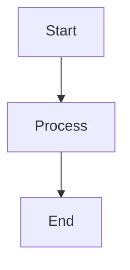

# TroopTrak Documentation

Welcome to the TroopTrak documentation repository. This directory contains comprehensive documentation for the TroopTrak military troop management application.

## 📚 Available Documentation

### [📖 User Guide](USER_GUIDE.md)
Complete guide for using TroopTrak as an end user (soldiers and commanders).

**Topics covered:**
- Getting started and authentication
- Profile management
- Conduct tracking
- Guard duty management
- Troubleshooting and FAQs

**Target audience:** All TroopTrak users

---

### [💻 Developer Guide](DEVELOPER_GUIDE.md)
Technical documentation for developing, maintaining, and deploying TroopTrak.

**Topics covered:**
- Architecture and design patterns
- Development environment setup
- Firebase configuration
- Database schema
- API reference
- Testing and deployment
- Security considerations

**Target audience:** Developers, DevOps engineers, System administrators

---

### [🏛️ Architecture Documentation](ARCHITECTURE.md)
Detailed system architecture, design patterns, and technical diagrams.

**Topics covered:**
- System architecture overview
- Component and class diagrams
- Data flow diagrams
- Sequence diagrams
- Deployment architecture
- Scalability and performance

**Target audience:** System architects, Technical leads

---

## 🚀 Quick Navigation

### For Users
- [Installation Guide](USER_GUIDE.md#-getting-started)
- [Authentication Setup](USER_GUIDE.md#phone-authentication)
- [Feature Overview](USER_GUIDE.md#-main-modules)
- [Troubleshooting](USER_GUIDE.md#-troubleshooting)
- [FAQ](USER_GUIDE.md#-faq)

### For Developers
- [Development Setup](DEVELOPER_GUIDE.md#️-development-setup)
- [Project Structure](DEVELOPER_GUIDE.md#-project-structure)
- [Database Schema](DEVELOPER_GUIDE.md#-database-schema)
- [API Reference](DEVELOPER_GUIDE.md#-api-reference)
- [Deployment Guide](DEVELOPER_GUIDE.md#-deployment)

### For Architects
- [System Architecture](ARCHITECTURE.md#system-overview)
- [Component Diagrams](ARCHITECTURE.md#component-diagrams)
- [Data Flow](ARCHITECTURE.md#data-flow)
- [Security Architecture](ARCHITECTURE.md#security-architecture)

---

## 🌐 GitHub Pages

This documentation is hosted on GitHub Pages. Visit the live documentation at:

**[View Documentation Online](https://yourusername.github.io/TroopTrak/)**

To set up GitHub Pages:

1. Go to repository Settings
2. Navigate to Pages section
3. Select branch: `main` or `gh-pages`
4. Select folder: `/docs`
5. Click Save

Your documentation will be available at:
```
https://<username>.github.io/<repository-name>/
```

---

## 📝 Documentation Structure

```
docs/
├── index.md              # Main landing page
├── README.md            # This file
├── USER_GUIDE.md        # User documentation
├── DEVELOPER_GUIDE.md   # Developer documentation
└── ARCHITECTURE.md      # Architecture documentation
```

---

## 🔄 Keeping Documentation Updated

### When to Update Documentation

- **User Guide:** When adding/modifying user-facing features
- **Developer Guide:** When changing architecture, APIs, or development processes
- **Architecture:** When making significant system design changes

### How to Update

1. Edit the relevant `.md` file
2. Follow the existing markdown formatting
3. Update table of contents if adding new sections
4. Add version history entry if applicable
5. Commit with clear message: `docs: update <guide-name> - <description>`

---

## 📖 Markdown Guidelines

### Formatting Standards

- Use ATX-style headers (`#` for h1, `##` for h2, etc.)
- Include table of contents for documents > 5 sections
- Use code fences with language specification:
  ````markdown
  ```dart
  // Dart code here
  ```
  ````
- Include diagrams using ASCII art or mermaid syntax
- Use badges for visual appeal (shields.io)

### Document Structure

Each documentation file should include:

1. **Title and badges** - Clear title with relevant badges
2. **Quick links** - Navigation to related docs
3. **Table of contents** - For easy navigation
4. **Main content** - Well-organized sections
5. **Support section** - Contact and resources
6. **Version info** - Version number and date

---

## 🎨 Styling with GitHub Pages

### Supported Themes

GitHub Pages supports Jekyll themes. To use a theme, create `_config.yml` in docs:

```yaml
theme: jekyll-theme-cayman
title: TroopTrak Documentation
description: Comprehensive documentation for TroopTrak
```

### Custom CSS

Create `assets/css/style.scss` to customize:

```scss
---
---

@import "{{ site.theme }}";

// Custom styles here
```

---

## 🖼️ Adding Diagrams

### ASCII Art Diagrams

Simple text-based diagrams:

```
┌─────────────┐
│   Header    │
├─────────────┤
│   Content   │
└─────────────┘
```

### Mermaid Diagrams



### Image Files

Store images in `docs/assets/images/`:

```markdown

```

---

## 🔍 Search Functionality

GitHub Pages includes built-in search for Jekyll sites. To enable:

1. Add to `_config.yml`:
```yaml
plugins:
  - jekyll-seo-tag
  - jekyll-sitemap
```

2. GitHub will automatically index your content

---

## 📱 Mobile Responsiveness

All documentation uses responsive markdown that works well on mobile devices. Test your changes on:

- Desktop browsers
- Mobile browsers
- GitHub mobile app

---

## ✅ Documentation Checklist

Before publishing documentation updates:

- [ ] Spell check completed
- [ ] Links verified (no broken links)
- [ ] Code examples tested
- [ ] Screenshots updated (if applicable)
- [ ] Table of contents updated
- [ ] Version number updated
- [ ] Mobile rendering checked
- [ ] Cross-references verified

---

## 🤝 Contributing to Documentation

### How to Contribute

1. **Fork the repository**
2. **Create documentation branch**
   ```bash
   git checkout -b docs/update-user-guide
   ```
3. **Make your changes**
   - Edit markdown files
   - Add diagrams if needed
   - Update cross-references
4. **Preview locally** (optional)
   ```bash
   # Using Jekyll (requires Ruby)
   gem install bundler jekyll
   cd docs
   jekyll serve
   # Visit http://localhost:4000
   ```
5. **Commit and push**
   ```bash
   git add .
   git commit -m "docs: describe your changes"
   git push origin docs/update-user-guide
   ```
6. **Create pull request**

### Review Process

Documentation PRs should be reviewed for:

- Accuracy of information
- Clarity and readability
- Proper formatting
- Working links and code examples
- Consistency with existing docs

---

## 📊 Documentation Metrics

Track documentation quality:

- **Coverage:** Ensure all features are documented
- **Clarity:** User feedback on understandability
- **Accuracy:** Technical correctness
- **Currency:** How recently updated
- **Accessibility:** Easy to find and navigate

---

## 🎯 Best Practices

### Writing Style

- **Be clear and concise** - Avoid jargon
- **Use active voice** - "Click the button" not "The button should be clicked"
- **Include examples** - Code snippets and screenshots
- **Structure logically** - Follow user's journey
- **Stay consistent** - Use same terminology throughout

### Code Examples

- **Keep examples simple** - Focus on one concept
- **Make them runnable** - Complete, working code
- **Add comments** - Explain complex parts
- **Show output** - Include expected results

### Diagrams

- **Use when helpful** - Not for everything
- **Keep them simple** - Focus on key concepts
- **Update regularly** - When system changes
- **Provide descriptions** - Explain what diagram shows

---

## 🔗 External Resources

### Markdown

- [GitHub Flavored Markdown](https://guides.github.com/features/mastering-markdown/)
- [Markdown Guide](https://www.markdownguide.org/)

### GitHub Pages

- [GitHub Pages Documentation](https://docs.github.com/en/pages)
- [Jekyll Documentation](https://jekyllrb.com/docs/)

### Diagrams

- [ASCII Art Generator](http://asciiflow.com/)
- [Mermaid Live Editor](https://mermaid-js.github.io/mermaid-live-editor/)

---

## 📞 Documentation Support

For questions about the documentation:

- **Technical issues:** Open a GitHub issue
- **Content questions:** Contact development team
- **Suggestions:** Submit a pull request

---

## 📄 License

This documentation is part of the TroopTrak project and follows the same license terms.

---

<div align="center">

**TroopTrak Documentation**

Version 1.0.0 | Last Updated: 2024

[](index.md)

</div>

